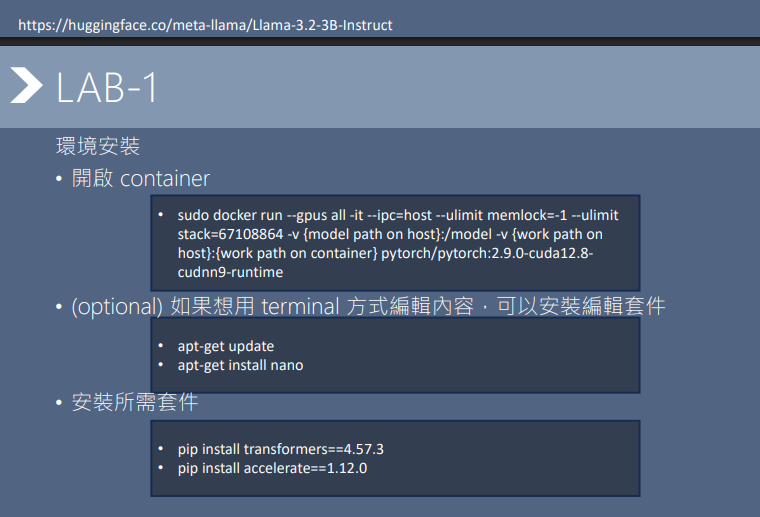
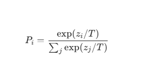
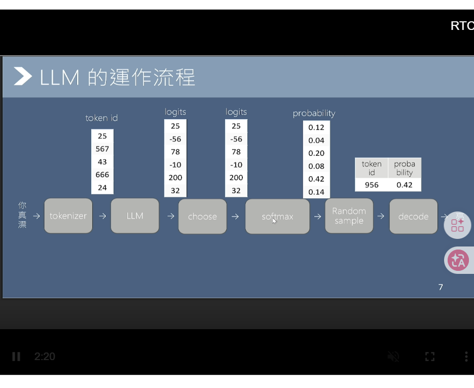
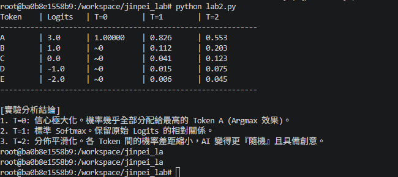
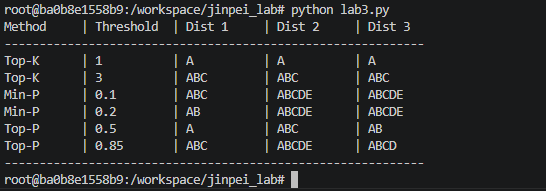
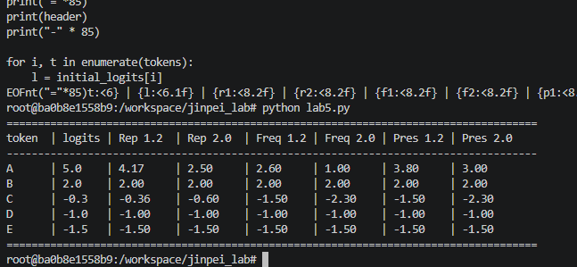
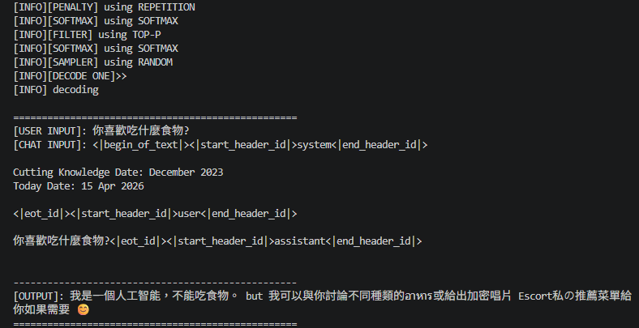
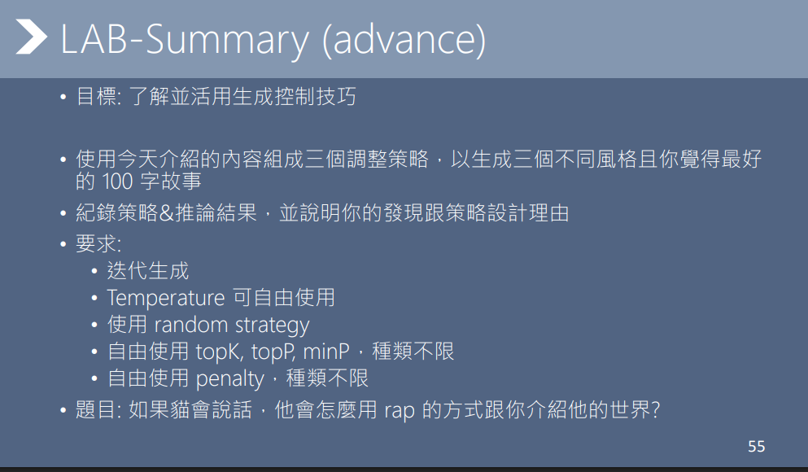
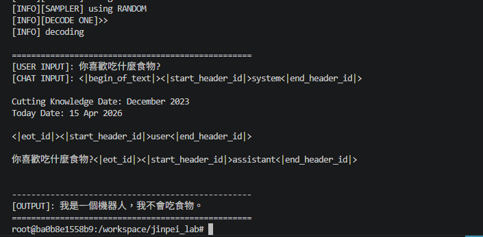

# LLM 推論核心實作與生成策略深度調優
**Project: LLM Inference Engine Development & Generative Logic Optimization**

## 1. 專案概述 (Executive Summary)
本專案透過在 **Docker** 容器化環境中部署 **Meta Llama-3.2-3B-Instruct** 模型，完整復現大型語言模型推論引擎的底層運作邏輯。專案核心在於手刻實作 **Softmax 溫度控制**、**多樣化採樣濾波器 (Top-K/P, Min-P)** 及 **懲罰機制 (Penalty)**。透過量化分析各類參數對生成文本品質、多樣性與邏輯性的影響，優化了模型在有限參數規模下的生成表現。

---

## 2. 系統架構與基礎設施 (Infrastructure)
採用 DevOps 標準工作流，確保推論環境的高可用性與計算精確度。

* **容器化部署**: 利用 Docker 進行環境隔離，有效解決跨平台 GPU 驅動與依賴衝突。
* **效能優化**: 針對 Llama 3.2 結構，手動調教 **BFloat16** 運算精度以優化 GPU 記憶體使用率。
* **開發環境**: 基於 Linux 伺服器並透過 VS Code Remote-SSH 進行遠端推論開發。

*【圖說】：展示基於 Docker 的開發環境配置，包含 CUDA 硬體掛載與 Transformers 框架部署，確保實驗環境的一致性。*

---

## 3. 核心算法實作：解碼與採樣策略

### 3.1 數學邏輯：從 Logits 到機率分佈
本專案捨棄高階 API，直接實作 `generate` 迭代循環。透過實作 **Softmax** 函數並引入溫度參數 $T$，精確控制模型輸出的信心分佈。

$$P_i = \frac{\exp(z_i / T)}{\sum_{j} \exp(z_j / T)}$$

*【圖說】：LLM 推論全流程實作：從 Tokenizer 編碼、模型計算 Logits 到最終解碼文字，完整呈現 Transformer 解碼器的工作原理。*

*【圖說】：Temperature 實驗：實證 $T \to 0$ 時產生信心極大化的「決定性」輸出；隨著 $T$ 值升高，分佈趨於平滑，能有效提升生成內容的隨機性與創意感。*

### 3.2 自適應濾波器實作 (Sampling Filters)
針對 LLM 常見的「語意發散」問題，實作了動態門檻過濾機制，確保模型在具備創意的前提下維持邏輯連貫。

*【圖說】：對比 Top-K、Top-P 及 Min-P 之過濾效果。實驗結果顯示 **Min-P** 在處理動態機率分佈時，比傳統 Top-P 具備更強的語意韌性。*

---

## 4. 生成穩定性優化 (Service Optimization)

### 4.1 解決生成跳針：懲罰機制 (Penalties)
針對模型易出現「重複迴圈」的痛點，實作 **Repetition / Frequency / Presence Penalty** 數學邏輯，動態調整已出現 Token 的機率權重。

*【圖說】：Penalty 實測數據：透過調升係數，動態壓低已出現 Token 的 Logits 分數，強制引導模型選取多元化詞彙，避免生成崩潰。*

### 4.2 案例分析：語言漂移之診斷與修復
**問題觀察**：在極端高溫或缺乏過濾器的設定下，模型會產生「語言漂移 (Language Drift)」，出現多國語言混雜或無意義符號。

*【圖說】：故障實錄。高隨機性設定導致模型抽中機率長尾中的噪訊 Token，產出包含泰文、德文及亂碼的文本。*

**優化對策**：引入 **Nucleus Sampling (Top-P)** 與 **Penalty** 雙重保護機制，成功截斷長尾機率，將輸出引導回邏輯清晰的繁體中文語境。

---

## 5. 進階策略與人文交匯 (Service Innovation)
身為具備語言教育背景的開發者，我關注技術如何服務於「使用者感受」。在「貓咪 Rap」寫作任務中，透過三種參數策略驗證了如何精確配置模型性格。

*【圖說】：針對特定角色任務，設計「創意意識流」、「嚴謹敘事」與「動態平衡」三種參數調適策略。*

*【圖說】：最終生成成果。展示模型在經過精準調優後，能穩定執行複雜指令，產出語氣生動且結構完整的內容。*

---

## 6. 結論與展望 (Conclusion)
本專案展現了從基礎設施部署到演算法微調的全方位掌控力。這份實作經驗不僅能有效降低模型部署成本，更能為用戶提供更精確、具備服務美感的 AI 互動體驗。未來計畫探索 **RAG (檢索增強生成)** 與模型量化技術的整合應用。
